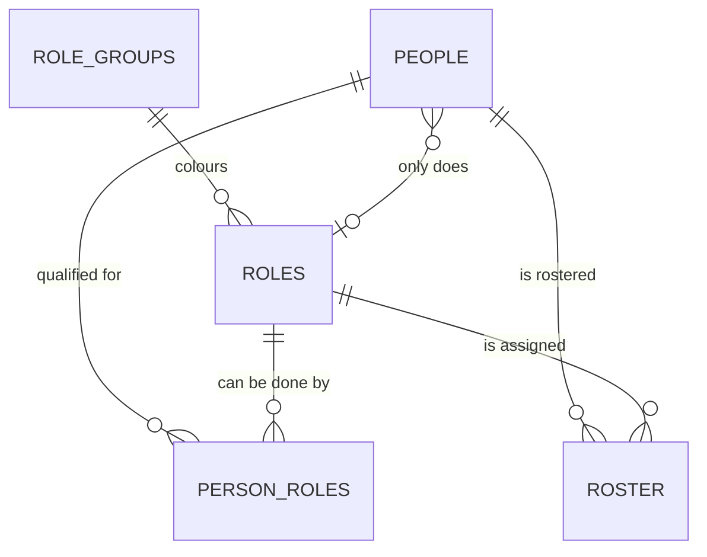
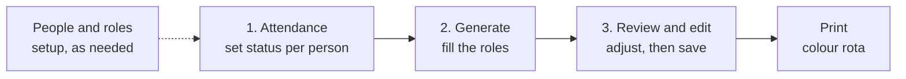

# Shift Manager App – Design Spec

2026-09-20 · @Someone

## Architecture

Data lives in one Excel workbook of formatted tables. The manager's screens and the Generate logic sit on top of it, and the print layout is an Excel sheet.

- **Data store:** an Excel workbook stored on OneDrive or SharePoint, with each table below as a named Excel table.
- **Front end, phase 1:** Excel sheets with dropdowns, tick boxes and conditional formatting, plus a Generate button (Office Script or VBA).
- **Front end, phase 2 (optional):** a Power Apps canvas app reading and writing the same tables, if phone or multi-user access is needed.
- **Why tables first:** every rule below works off the tables, so changing the front end later does not change the data.

## Data model

Five core tables. A person can be qualified for many roles, and the roster has one row per person per date.

PERSON\_ROLES is the qualification checklist. ROLE\_GROUPS holds the car, beat and inside groups that drive the print colours.

## Table definitions

**People** (about 23 rows)

| Column | Type | Notes |
| --- | --- | --- |
| PersonID | Number | Primary key |
| Name | Text |  |
| Active | Yes/No | Untick instead of deleting, so old rosters keep their names |
| FixedRoleID | Number | Optional. Only set for fixed-role people (currently one). Must be a role they are qualified for |

**Roles** (16 rows)

| Column | Type | Notes |
| --- | --- | --- |
| RoleID | Number | Primary key |
| RoleName | Text |  |
| GroupID | Number | Links to RoleGroups, drives print colour |
| UsedAtNight | Yes/No | 14 of the 16 are Yes |
| Hard | Yes/No | Hard roles are not given on consecutive nights |
| SkillRestricted | Yes/No | True for Car 1, Car 2, MIC and Jailer. Informational, since qualification comes from PersonRoles |
| SortOrder | Number | Order on the printout |

**RoleGroups** (a handful of rows)

| Column | Type | Notes |
| --- | --- | --- |
| GroupID | Number | Primary key |
| GroupName | Text | For example Car, Beat, Inside |
| Colour | Text | Hex colour used on the print |

**PersonRoles** (one row per qualification)

| Column | Type | Notes |
| --- | --- | --- |
| PersonID | Number | Links to People |
| RoleID | Number | Links to Roles |

A person with no row for a role cannot be assigned it.

**Roster** (one row per person per date, and doubles as the log)

| Column | Type | Notes |
| --- | --- | --- |
| RosterID | Number | Primary key |
| Date | Date |  |
| Shift | Choice | Day or Night |
| PersonID | Number | Links to People |
| Status | Choice | Present, Annual leave, Sick leave, Duty away |
| RoleID | Number | Blank unless Present |
| Source | Choice | Generated or Manual |
| SavedOn | Date/time | When the row was written |

Status colours for the print: Annual leave is blue. The other statuses are set in a small Status list on the Settings sheet.

## Generation algorithm

Generate runs for one four-day block, one shift at a time, in date order so it can see the previous day.

1. Take everyone with status Present for that date and shift.
2. Roles for the shift: all 16 by day, the 14 with UsedAtNight for nights.
3. Give fixed-role people their fixed role first.
4. Fill the skill-restricted roles next. For each, pick from Present people qualified for it. Fill the most restricted roles first, meaning those with the fewest qualified people.
5. Shuffle the remaining roles into a random order, then fill each from the remaining people who are qualified for it.
6. When several people qualify, pick using these preferences, in order:
   1. Not the same role they had on their previous working day.
   2. For a hard role on a night shift, not someone who had a hard role the night before.
   3. Prefer the person who has done that role least recently, using the Roster log.
   4. Random tie-break.
7. Write the rows to Roster with Source set to Generated.
8. If a role cannot be filled, leave it blank and show a warning with the role name.

## Screens and user flow

The manager's flow on the last night of a block runs through three screens.

**1. Attendance.** Pick the first date of the block. A list shows every active person with a status dropdown (Present, Annual leave, Sick leave, Duty away) for each of the four days, defaulting to Present.

**2. Generate.** One button builds the roster for the block. Warnings appear at the top for any role left unfilled.

**3. Review and edit.** The roster grid shows roles down the side and days across, coloured by role group. Each cell has a dropdown limited to people qualified for that role, so a manual change cannot break the skill rule. Save writes to the log.

**People and roles setup.** Used occasionally:

- Add or deactivate a person.
- Open a person to see the 16 roles as tick boxes, plus an "only do this role" dropdown that lists just the ticked roles.
- Edit the role list, groups and hard or easy flags.

## Printed rota, logging and build plan

Print layout: one landscape page per shift, roles as rows and the four days as columns. Each role cell shows the person's name, filled with the role group colour, so pairs such as the car crew share a colour. Annual leave is blue, beat roles are green, and inside duties get their own colour. People on leave or away are listed in a strip under the grid.

Logging: each save appends to Roster with a SavedOn time. Older blocks are found by date. If edits must be tracked, add a RosterChanges table later with who, when, old and new value.

Build plan:

1. Create the workbook and tables, and load the 16 roles, groups and 23 people.
2. Enter the qualification checklists and the fixed-role setting.
3. Build the Attendance and Review screens with dropdowns and colours.
4. Write the Generate script and test it against a known past roster.
5. Build the print layout.
6. Trial one real four-day block alongside the manual method.
